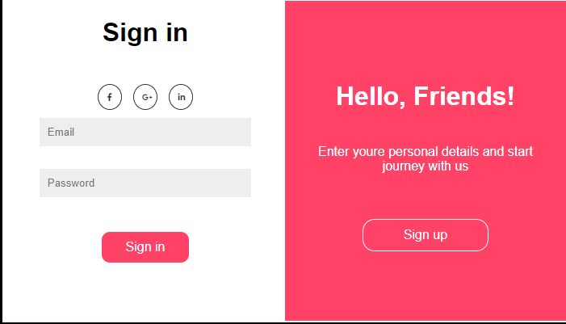
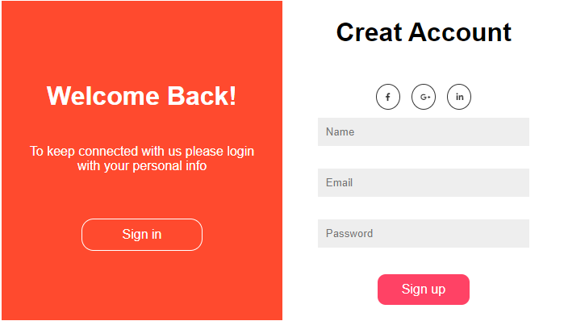

This is a sign-in sign-up project for studying javascript validation.

I used HTML, CSS and Javascript.

This is made in march 2020.

The two forms in the same card,

When you press on sign in button

When you press on sign up button

live preview (https://raw.githack.com/AhmedAmin90/oldProjects-signInSignOut-validation-form/feature/index.html)
